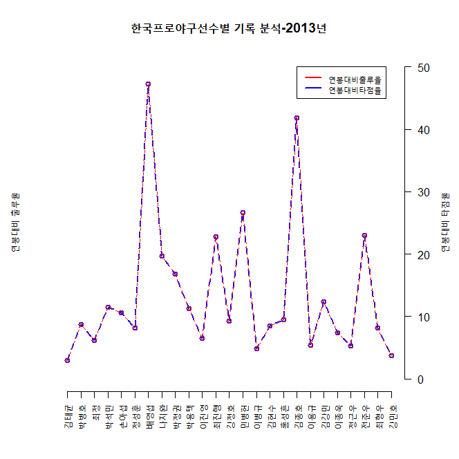

```{r setup, include=FALSE}
knitr::opts_chunk$set(echo = TRUE)
```

## R Markdown

This is an R Markdown document. Markdown is a simple formatting syntax for authoring HTML, PDF, and MS Word documents. For more details on using R Markdown see <http://rmarkdown.rstudio.com>.

When you click the **Knit** button a document will be generated that includes both content as well as the output of any embedded R code chunks within the document. You can embed an R code chunk like this:

```{r cars}
summary(cars)
```

## Including Plots

You can also embed plots, for example:

```{r pressure, echo=FALSE}
plot(pressure)
```

Note that the `echo = FALSE` parameter was added to the code chunk to prevent printing of the R code that generated the plot.

# 제목1
## 제목2
### 제목3
#### 제목4
헤더 처리 하지 않은 경우 일반적인 폰트 사이즈
##### 제목5
###### 제목6

제목7
=====

제목8
-----

*이탈릭체1*
**볼드체1**
_이탈릭체2_
__볼드체2__
* 이탈릭체3 *
** 이탈릭체4 **


일반 쓰기

* 순서 없는 글머리기호1 with *표
* 순서 없는 글머리기호2 with *표
    + 순서 없는 글머리기호3 with +표 and 들여쓰기
    - 순서 없는 글머리기호4 with -표 and 들여쓰기
    
1. 순서 있는 글머리기호1

2) 순서 있는 글머리기호2

    A. 순서 있는 글머리기기호3 with 들여쓰기
    
    B) 순서 있는 글머리기호4 with 들여쓰기
    
    C) 순서 있는 글머리기호5 with 들여쓰기
    
    현재 수준에서 공백 4개 후 입력하면 들여쓰기만 처리됨


이미지 삽입



디스플레이 수식
$$ y_{i} = \sqrt[3]{x_{i}} + \sum_{1}^{n} $$

인라인 수식

문장 안에서도$y_{i} = \sqrt[3]{x_{i}} + \sum_{1}^{n}$ 와 같이 수식 입력 가능


수평선 그리기

***
----------


테이블 만드는 방법


```{r test1}
a = -5:5
b = a^3
c = data.frame(a,b)

library(ggplot2)

ggplot(data = c, aes(x = a, y = b)) +
  geom_point() +
  geom_line(color = "BLUE")

```


### mtcars 데이터셋의 요약

mtcars 데이터셋의 행과 열의 수는 각각 'r dim(mtcars)' 개이며, 이중 hp열의 평균은 'r round(mean(mtcars$hp), 2)' 이다


2. 정적인 표 그리기


kntir 패키지의 kable() 함수
  kable() 함수는 함수 안에 표에 표시하기를 원하는 데이터 명을 기재하기만 하면,
  
  
caption 옵션 : 표의 제목 지정,
align 옵션 : 열 별 정렬.
results 옵션 : 코드 청크의 결과물을 markdown으로 바꿀지 여부를 결정하는 것

3. 동적인 표 : DT 패키지의 datatable() 함수

DT 패키지는 DataTables ~

사용 예 :

```{r}
#install.packages("DT")
library(DT)

datatable(iris,
          caption = "DT 패키지를 활용한 표",
          filter="top")
```


